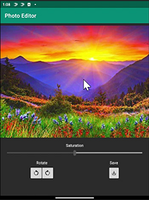
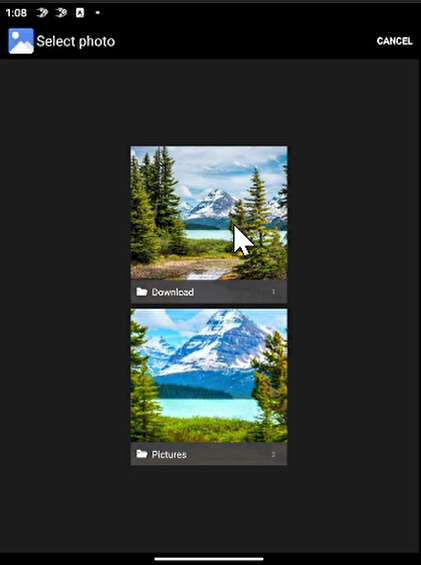

# Photo Editor

This Kotlin application implements a simple photo editor that lets users select, edit, and save images. It's also a good example of how to use the [Companion Pane](https://docs.microsoft.com/en-us/dual-screen/introduction#dual-screen-app-patterns) pattern.

## Getting started

To learn how to load apps on the Surface Duo emulator, see the [documentation](https://docs.microsoft.com/dual-screen/android), and follow [the blog](https://devblogs.microsoft.com/surface-duo).

## Features

- Image selection - click on current image to open photo gallery

     

- Number of available controls for editing the image changes when switching between single and dual screen modes

## Notes

This application uses a beta release of the [Constraint Layout](https://developer.android.com/jetpack/androidx/releases/constraintlayout) package to facilitate image editing. To see the basic functionality of this sample with a stable release, check out [this](https://github.com/microsoft/surface-duo-app-samples/tree/1c3d8e3b3d5b43ba4bd6baf8731e8c9d8fb55695) commit.

## Contributing

This project welcomes contributions and suggestions.  Most contributions require you to agree to a
Contributor License Agreement (CLA) declaring that you have the right to, and actually do, grant us
the rights to use your contribution. For details, visit https://cla.opensource.microsoft.com.

When you submit a pull request, a CLA bot will automatically determine whether you need to provide
a CLA and decorate the PR appropriately (e.g., status check, comment). Simply follow the instructions
provided by the bot. You will only need to do this once across all repos using our CLA.

This project has adopted the [Microsoft Open Source Code of Conduct](https://opensource.microsoft.com/codeofconduct/).
For more information see the [Code of Conduct FAQ](https://opensource.microsoft.com/codeofconduct/faq/) or
contact [opencode@microsoft.com](mailto:opencode@microsoft.com) with any additional questions or comments.
