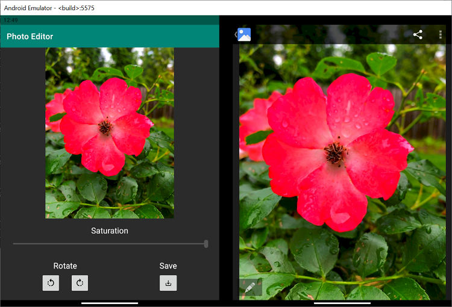
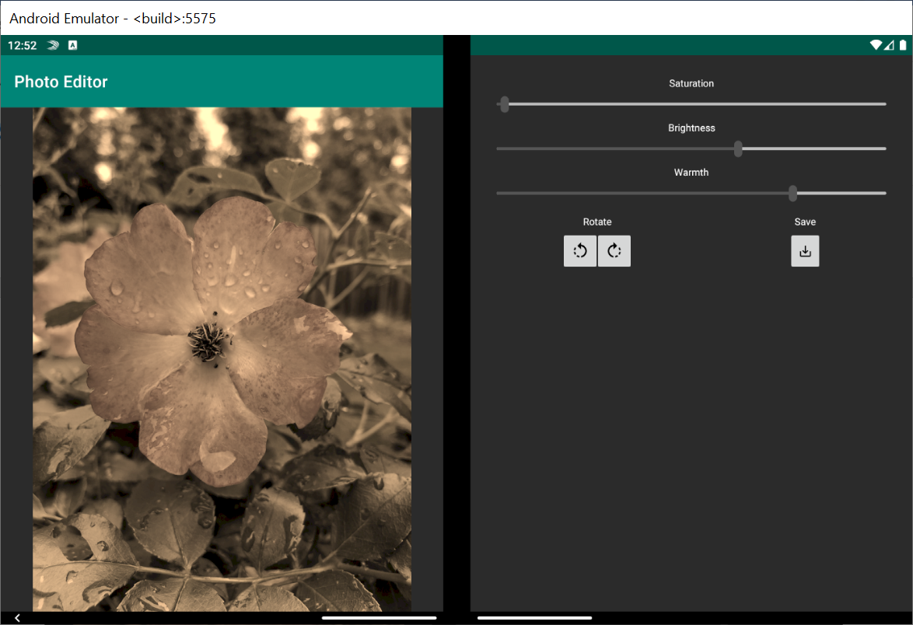

# Photo Editor

This Kotlin application implements a simple photo editor that lets users select, edit, and save images. Screenshots of the application and its behavior are available [here](screenshots/).

## Prerequisites

* Android Studio
* Surface Duo emulator

This application also uses a beta release of the [Constraint Layout](https://developer.android.com/jetpack/androidx/releases/constraintlayout) package to facilitate image editing with the ImageFilterView class, and all button icons were downloaded from the [Android Material Design](https://material.io/resources/icons/?style=baseline) website.

## Running the sample

* Start Android Studio.
* Open the PhotoEditor project: **File > Open**, navigate to file location of the  the **PhotoEditor** folder, then click **OK**.
* Build your project: **Build > Make Project** or **Ctrl+F9**
* Start the Surface Duo emulator
* Select **"Microsoft SurfaceDuoEmulator API 29"** or **"Virtual Device"** from the list of Running Devices.
* Run the project on the emulator: **Run > Run 'app'**, **Ctrl+F2**, or click the green play button.

## Key concepts

### App features

* Select: click on current image to open photo gallery or drag and drop image file
* Edit: click on buttons and adjust sliders to modify image properties
  - Buttons: rotate left and right
  - Sliders: saturation, brightness, warmth
* Save: click save button to download edited image to device (see below)

### Companion Pane

This sample shows how the [Companion Pane](https://docs.microsoft.com/dual-screen/introduction#companion-pane) dual-screen app pattern can be used to make more tools and controls available to users when the app is spanned. When in single-screen mode, the app only shows users three controls: the slider, the rotation buttons, and the save button. In order to modify all possible properties with the slider, the user must interact with the dropdown menu. This ensures that the chosen image is large enough on the screen to inspect any edits.

When switched to dual-screen mode, however, the entire left screen can be dedicated to image display. This frees up the right screen to display more editing controls. As a result, a dropdown menu is no longer needed and all three slider controls can be displayed.

### Drag and drop

This sample also demonstrates how drag and drop features can simplify file transfer across screens and between applications. For more information on drag and drop, check out [this sample](https://github.com/microsoft/surface-duo-sdk-samples-kotlin/tree/master/draganddrop).

### Dual screen layout

The SurfaceDuoLayout element of the [DualScreen-Layout](https://docs.microsoft.com/dual-screen/android/api-reference/dualscreen-layout?tabs=java) package is the key to developing applications on the Surface Duo. This layout provides different attributes for single-screen and dual-screen views, and example usage can be seen in [activity_main.xml](app/src/main/res/layout/activity_main.xml).

> [!NOTE]
> When defining landscape and portrait orientations for the dual-screen view, the two screens are treated as one. That means the dual-screen landscape orientation is when the single-screen orientation would be considered portrait (shown below) and vice versa. For more tips, check out [this blog post](https://devblogs.microsoft.com/surface-duo/introducing-dual-screen-layouts-android/).

## Contributing

This project welcomes contributions and suggestions.  Most contributions require you to agree to a
Contributor License Agreement (CLA) declaring that you have the right to, and actually do, grant us
the rights to use your contribution. For details, visit https://cla.opensource.microsoft.com.

When you submit a pull request, a CLA bot will automatically determine whether you need to provide
a CLA and decorate the PR appropriately (e.g., status check, comment). Simply follow the instructions
provided by the bot. You will only need to do this once across all repos using our CLA.

This project has adopted the [Microsoft Open Source Code of Conduct](https://opensource.microsoft.com/codeofconduct/).
For more information see the [Code of Conduct FAQ](https://opensource.microsoft.com/codeofconduct/faq/) or
contact [opencode@microsoft.com](mailto:opencode@microsoft.com) with any additional questions or comments.
