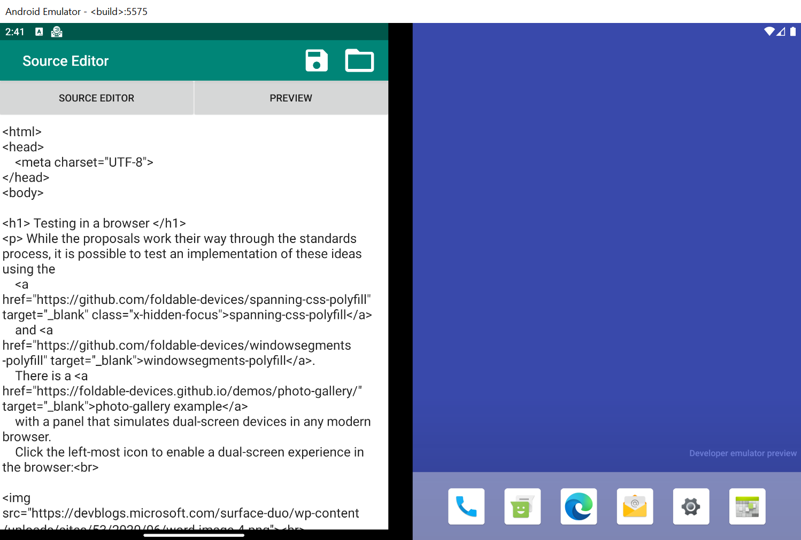
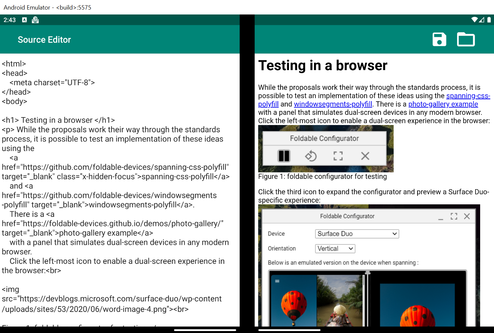
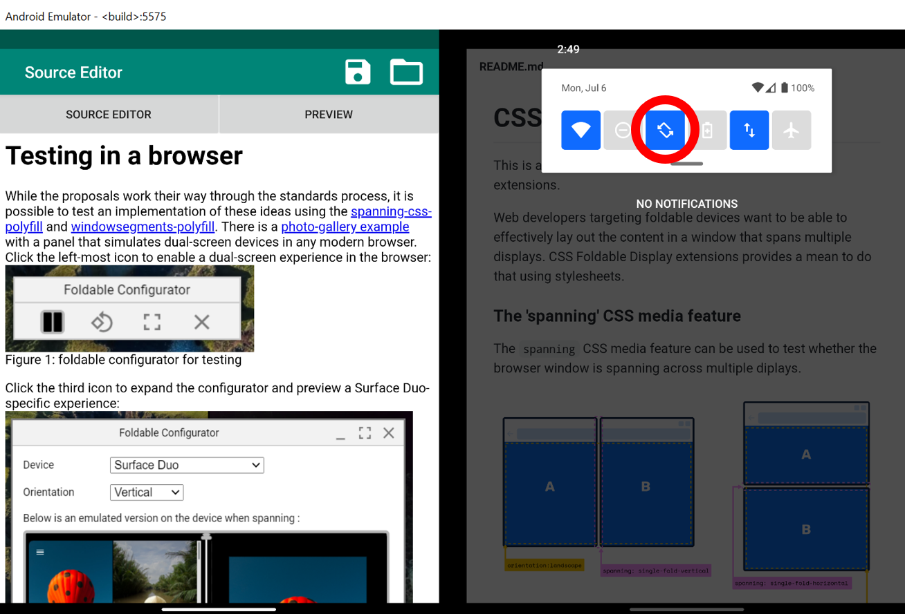

# Introduction

This sample contains a Kotlin application designed for Surface Duo. The application is an HTML
 editor that enables real-time rendering of formatted source code. Making use of the
 [Dual View](https://docs.microsoft.com/dual-screen/introduction#dual-view)
 app pattern, users are able to edit and preview any changes simultaneously without switching
 windows.

## Getting Started

To learn how to load your app on to emulator, and to use it, see the full documentation here: [https://docs.microsoft.com/dual-screen](https://docs.microsoft.com/dual-screen)

## Features

This project uses [Fragments](https://developer.android.com/guide/components/fragments), one to display a code editing window and another to render and display formatted code through a [WebView](https://developer.android.com/reference/android/webkit/WebView). The app starts in single screen mode, but can be spanned to enable dual screen mode. See the Getting Started section above for more information about spanning.

If more content exists than can be displayed on the screen at once, users can scroll to view hidden content. In dual screen mode, scrolling of one screen (either editor or preview) will be mirrored on the other screen to ensure the user is always looking at relevant content.

### Single Screen Mode

In single screen mode, users are able to view one of two screens at a time: editor or preview. A button appears in the editor window that allows users to view a preview of the source code. In order to go back to the editor from the preview screen, perform Android's "back" gesture or by pressing the back button on your device. In single screen mode, users can reference other sites such as developer forums while using the app.

### Dual Screen Mode

In dual screen mode, both windows are visible, so no buttons are visible to enable transitions. In this layout, users can scroll on the code side, subsequently scrolling the preview screen, and vice versa. Changes to text in the editor will update the preview in real time using a [ViewModel](https://developer.android.com/topic/libraries/architecture/viewmodel).

### Orientation

This project supports various rotation configurations. In order to enable orientation changes within the application, ensure that rotation is enabled within the Duo emulator/device itself. This can be done by swiping down from the top of the screen and selecting the rotation icon. Examples of different orientation layouts are available in the screenshots folder.

## Contributing

This project welcomes contributions and suggestions.  Most contributions require you to agree to a
Contributor License Agreement (CLA) declaring that you have the right to, and actually do, grant us
the rights to use your contribution. For details, visit https://cla.opensource.microsoft.com.

When you submit a pull request, a CLA bot will automatically determine whether you need to provide
a CLA and decorate the PR appropriately (e.g., status check, comment). Simply follow the instructions
provided by the bot. You will only need to do this once across all repos using our CLA.

This project has adopted the [Microsoft Open Source Code of Conduct](https://opensource.microsoft.com/codeofconduct/).
For more information see the [Code of Conduct FAQ](https://opensource.microsoft.com/codeofconduct/faq/) or
contact [opencode@microsoft.com](mailto:opencode@microsoft.com) with any additional questions or comments.

## License

Copyright (c) Microsoft Corporation.

MIT License

Permission is hereby granted, free of charge, to any person obtaining a copy of this software and associated documentation files (the "Software"), to deal in the Software without restriction, including without limitation the rights to use, copy, modify, merge, publish, distribute, sublicense, and/or sell copies of the Software, and to permit persons to whom the Software is furnished to do so, subject to the following conditions:

The above copyright notice and this permission notice shall be included in all copies or substantial portions of the Software.

THE SOFTWARE IS PROVIDED AS IS, WITHOUT WARRANTY OF ANY KIND, EXPRESS OR IMPLIED, INCLUDING BUT NOT LIMITED TO THE WARRANTIES OF MERCHANTABILITY, FITNESS FOR A PARTICULAR PURPOSE AND NONINFRINGEMENT. IN NO EVENT SHALL THE AUTHORS OR COPYRIGHT HOLDERS BE LIABLE FOR ANY CLAIM, DAMAGES OR OTHER LIABILITY, WHETHER IN AN ACTION OF CONTRACT, TORT OR OTHERWISE, ARISING FROM, OUT OF OR IN CONNECTION WITH THE SOFTWARE OR THE USE OR OTHER DEALINGS IN THE SOFTWARE.
